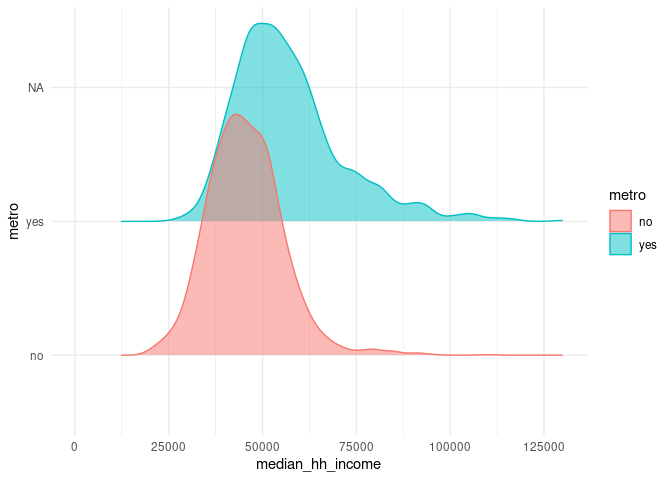

Key\_4\_EDA\_Numerical\_Categorical\_Data
================
Mr. Adams

-   [By the end of this tutorial, you should be able
    to…](#by-the-end-of-this-tutorial-you-should-be-able-to)
-   [1: Load the libraries](#1-load-the-libraries)
-   [2: Load and learn about the data](#2-load-and-learn-about-the-data)
    -   [2: Tasks and Questions](#2-tasks-and-questions)
-   [3: Ask statistical questions that lead you to explore numerical
    data across different
    groups](#3-ask-statistical-questions-that-lead-you-to-explore-numerical-data-across-different-groups)
    -   [3: Tasks and Questions](#3-tasks-and-questions)
-   [4: Build box plots and generate the supporting
    statistics](#4-build-box-plots-and-generate-the-supporting-statistics)
    -   [4.1: Build the box plot](#41-build-the-box-plot)
        -   [4.1: Tasks and Questions](#41-tasks-and-questions)
        -   [4.2 Tasks and Questions](#42-tasks-and-questions)
    -   [4.3 Answer your question and consider what you’re
        missing.](#43-answer-your-question-and-consider-what-youre-missing)
        -   [4.3 Tasks and Questions.](#43-tasks-and-questions)
-   [5. Build faceted histograms.](#5-build-faceted-histograms)
    -   [5.1a: Tasks and Questions](#51a-tasks-and-questions)
-   [6: Build a Ridge Plot](#6-build-a-ridge-plot)
    -   [6: Tasks and Questions](#6-tasks-and-questions)
-   [7 - Bonus: Two Numerical Variables and a Categorical
    Variable](#7---bonus-two-numerical-variables-and-a-categorical-variable)
    -   [7 - Bonus: Tasks and Questions](#7---bonus-tasks-and-questions)

Up to this point, you’ve explored data that is either numerical or
categorical. Here, you will expand the scope of questions you can
explore by comparing numerical data across different groups.

Let’s get after it.

# By the end of this tutorial, you should be able to…

# 1: Load the libraries

As always, run the library code first.

``` r
library(tidyverse)
```

    ## ── Attaching packages ─────────────────────────────────────── tidyverse 1.3.1 ──

    ## ✓ ggplot2 3.3.5     ✓ purrr   0.3.4
    ## ✓ tibble  3.1.5     ✓ dplyr   1.0.7
    ## ✓ tidyr   1.1.4     ✓ stringr 1.4.0
    ## ✓ readr   2.0.2     ✓ forcats 0.5.1

    ## ── Conflicts ────────────────────────────────────────── tidyverse_conflicts() ──
    ## x dplyr::filter() masks stats::filter()
    ## x dplyr::lag()    masks stats::lag()

``` r
library(openintro)
```

    ## Loading required package: airports

    ## Loading required package: cherryblossom

    ## Loading required package: usdata

``` r
library(skimr)
library(ggridges)
library(knitr)
```

# 2: Load and learn about the data

Throughout this tutorial, the data frame you will explore, named county,
is referenced in our textbook, Introduction to Modern Statistics, and is
included in the openintro package.

## 2: Tasks and Questions

1.  Run the code chunk below.

2.  What is the name of the data frame?

county

3.  What are the observational units and how many are there?

Counties in the United States

4.  How many numerical variables are there in this data frame?

3,142

5.  How many categorical variables are there in this data frame?

5

``` r
?county
glimpse(county)
```

    ## Rows: 3,142
    ## Columns: 15
    ## $ name              <chr> "Autauga County", "Baldwin County", "Barbour County"…
    ## $ state             <fct> Alabama, Alabama, Alabama, Alabama, Alabama, Alabama…
    ## $ pop2000           <dbl> 43671, 140415, 29038, 20826, 51024, 11714, 21399, 11…
    ## $ pop2010           <dbl> 54571, 182265, 27457, 22915, 57322, 10914, 20947, 11…
    ## $ pop2017           <int> 55504, 212628, 25270, 22668, 58013, 10309, 19825, 11…
    ## $ pop_change        <dbl> 1.48, 9.19, -6.22, 0.73, 0.68, -2.28, -2.69, -1.51, …
    ## $ poverty           <dbl> 13.7, 11.8, 27.2, 15.2, 15.6, 28.5, 24.4, 18.6, 18.8…
    ## $ homeownership     <dbl> 77.5, 76.7, 68.0, 82.9, 82.0, 76.9, 69.0, 70.7, 71.4…
    ## $ multi_unit        <dbl> 7.2, 22.6, 11.1, 6.6, 3.7, 9.9, 13.7, 14.3, 8.7, 4.3…
    ## $ unemployment_rate <dbl> 3.86, 3.99, 5.90, 4.39, 4.02, 4.93, 5.49, 4.93, 4.08…
    ## $ metro             <fct> yes, yes, no, yes, yes, no, no, yes, no, no, yes, no…
    ## $ median_edu        <fct> some_college, some_college, hs_diploma, hs_diploma, …
    ## $ per_capita_income <dbl> 27841.70, 27779.85, 17891.73, 20572.05, 21367.39, 15…
    ## $ median_hh_income  <int> 55317, 52562, 33368, 43404, 47412, 29655, 36326, 436…
    ## $ smoking_ban       <fct> none, none, partial, none, none, none, NA, NA, none,…

``` r
view(county)
```

# 3: Ask statistical questions that lead you to explore numerical data across different groups

As you know, questions appear at the top of our statistics wheel. You
collect data, create visualizations, and generate statistics to help you
answer your questions. Being able to ask good statistical questions is a
key element to your work as a statistician and data scientist. Like any
skill, you need to practice to develop your abilities! Let’s do that
now.

## 3: Tasks and Questions

1.  Write down a question that would require you to explore one
    numerical variable and one categorical variable.

How does the poverty rate in counties that contain a metropolitan area
compare to those counties that do not have a metropoloitan area?

2.  What is the name of each variable? Be sure to write each name
    EXACTLY as it appears in the data frame.

poverty

metro

3.  Write down a second question that would require you to explore one
    numerical variable and one categorical variable.

Is there an association between a county’s median education level and
median household income?

4.  What is the name of each variable? Be sure to write each name
    EXACTLY as it appears in the data frame.

median\_edu

median\_hh\_income

5.  Call Mr. Adams over to discuss the questions you just wrote
    questions.

# 4: Build box plots and generate the supporting statistics

Displaying multiple box plots is a way to construct a visualization to
compare numerical data distributions across different categories. In
this section of the tutorial, you will begin to explore the questions
you asked above by creating box plots. In this section of the tutorial,
you will begin to explore the questions you asked above by creating box
plots.

## 4.1: Build the box plot

As you work through the tasks and questions, you will reference one of
the questions you wrote in part 3.

### 4.1: Tasks and Questions

1.  Replace NAME\_OF\_DATA\_FRAME, NUMERICAL\_VARIABLE,
    CATEGORICAL\_VARIABLE. (\*\*Note: The second line of this code tells
    the computer to filter or take out any cells that do not have a
    number. When a cell in your data frame is empty, it will
    automatically be filled with NA. The code you read there filters out
    any cell in the column of the variable you’ve defined that has NA in
    it)

2.  Run the code.

3.  Add layers to this code to improve the title and labels on each axis
    and make it have the theme\_minimal.

``` r
county %>%
  filter(!is.na(median_hh_income)) %>%
  ggplot(aes(x = median_hh_income, y = median_edu, color = median_edu)) +
  geom_boxplot()
```

<!-- -->
\#\# 4.2: Generate the statistics to support what’s shown in the box
plot.

Once again, we need to generate statistics to provide more information
about the visualization.

To do this, we need to use a few functions used to wrangle our data. The
three functions are: - filter - group\_by - select.

filter - You do not always need to use this. We use it in this case
because we do not want to include any cells in our numerical variable
column that have an NA.

group\_by - This function tells the computer to group all of the
observations that share the same level.

select - This tells the computer, “Hey, I know you have a ton of
variables in this data frame, but I just want this specific variable.”
You can also select multiple variables by just listing them with commas
in between them.

### 4.2 Tasks and Questions

1.  Replace NAME\_OF\_DATA\_FRAME, NUMERICAL\_VARIABLE,
    CATEGORICAL\_VARIABLE to generate the statistics that support the
    box plots you made in the previous section.

2.  Run the code.

``` r
county %>%
  filter(!is.na(median_hh_income)) %>%
  group_by(median_edu) %>%
  select(median_hh_income) %>%
  skim()
```

    ## Adding missing grouping variables: `median_edu`

|                                                  |             |
|:-------------------------------------------------|:------------|
| Name                                             | Piped data  |
| Number of rows                                   | 3140        |
| Number of columns                                | 2           |
| \_\_\_\_\_\_\_\_\_\_\_\_\_\_\_\_\_\_\_\_\_\_\_   |             |
| Column type frequency:                           |             |
| numeric                                          | 1           |
| \_\_\_\_\_\_\_\_\_\_\_\_\_\_\_\_\_\_\_\_\_\_\_\_ |             |
| Group variables                                  | median\_edu |

Data summary

**Variable type: numeric**

| skim\_variable     | median\_edu   | n\_missing | complete\_rate |     mean |       sd |    p0 |      p25 |     p50 |       p75 |   p100 | hist  |
|:-------------------|:--------------|-----------:|---------------:|---------:|---------:|------:|---------:|--------:|----------:|-------:|:------|
| median\_hh\_income | below\_hs     |          0 |              1 | 25966.50 |  1649.68 | 24800 | 25383.25 | 25966.5 |  26549.75 |  27133 | ▇▁▁▁▇ |
| median\_hh\_income | hs\_diploma   |          0 |              1 | 42428.44 |  8461.18 | 19264 | 36716.00 | 41715.0 |  47574.00 |  85192 | ▂▇▅▁▁ |
| median\_hh\_income | some\_college |          0 |              1 | 54842.38 | 11915.55 | 26063 | 46833.00 | 52784.0 |  60603.50 | 106761 | ▂▇▃▁▁ |
| median\_hh\_income | bachelors     |          0 |              1 | 86543.70 | 21161.42 | 52651 | 67542.75 | 90353.0 | 104413.00 | 129588 | ▇▅▇▇▂ |

## 4.3 Answer your question and consider what you’re missing.

You’ve created a visualization and generated summary stats. Time to
start making sense of what they tell you.

### 4.3 Tasks and Questions.

1.  Using information learned through your box plots and the statistics
    you generated, answer the question you asked. Be sure to comment on
    shape, center, and spread using statistical vocabulary and relevant
    statistics in your answer.

It appears that there is a relationship between a county’s median
education level and median household income. This is evident in a few
ways. The median household income in those counties that have a median
education level of bachelors is $90,353 and the median house income of
all other groups is less. In fact, the median household income of nearly
all of the counties in the bachelors group, is higher than the median
value of all of the other groups.

2.  Despite learning information to help answer your questions, what
    information might you be missing from the visualization you created?
    List at least two pieces of information.

At this point, we do not know how many counties fall into each group. We
also don’t know if any of these distributions are bi or multi modal.

3.  What is another visualization that could help you uncover those
    missing pieces of information?

You could create a histogram for each group or a ridge plot.

# 5. Build faceted histograms.

Because you realized that the box plots might be hiding something,
you’ll want to pop up other visualizations that will help you see if
they tell you more. Once you have both created, you can determine which
one best communicates the story in the data that answers your question.

You will now create histograms for each level of your categorical
variable and stack them.

For this section, you will continue to use the same variables you used
in part 4.

## 5.1a: Tasks and Questions

1.  Replace NAME\_OF\_DATA\_FRAME and NUMERICAL\_VARIABLE

2.  The last line of code is going to do the stacking or faceting. You
    want to facet it by the categorical variable and then make the
    number of rows equal to the number of levels.

Change CATEGORICAL\_VARIABLE and NUMBER\_OF\_LEVELS

3.  Run the code.

4.  Add layers to this code to improve the title and labels on each axis
    and make it have the theme\_minimal.

``` r
 county %>%
  filter(!is.na(median_hh_income)) %>%
  ggplot(aes(x = median_hh_income)) +
  geom_histogram(binwidth = 1000) +
  facet_wrap(~median_edu, nrow = 4) +
  labs(
    title = "Is there a relationship between the median education level \nof a country and the median household income?",
    subtitle = "Most counties have a median education level of high school diploma or some college, \nbut the small number that have a median education level of bachelors tend \nto have higher median household incomes.",
    x = "Median Household Income",
    y = "Number of Counties",
  ) +
  theme_minimal()
```

<!-- -->
\#\# 5.1b: Tasks and Questions

1.  Did you learn anything new by looking at the visualizations you
    created?

I learned that most counties fit into either the high school diploma or
some college groups. Also, there are only a couple of counties in these
data that have a median education level of below high school. Also, the
bachelors group has far fewer counties in it than the high school
diploma and the some college group.

2.  What new questions does this information raise?

Where are those counties in the bachelors group? Do the bachelors
counties also tend to have lower unemployment rates? Are the poverty
rates different across these groups as well?

3.  Call Mr. Adams over to chat through your work on the tutorial thus
    far.

# 6: Build a Ridge Plot

A ridge plot is one more way to visualize distributions across different
groups.

For this part of the tutorial, we will explore the question:

Is there a relationship between a county’s median household income and
whether or not that county contains a metropolitan area?

## 6: Tasks and Questions

1.  Which variables would we need to use to explore that question? Type
    the names of the variables EXACTLY as they appear in the data frame.

2.  Add in a row that filters out any NA values for the numerical
    variable.

3.  Run the code.

``` r
county %>%
   filter(!is.na(median_hh_income)) %>%
  ggplot(aes(x = median_hh_income, 
             y = metro, 
             color = metro, 
             fill = metro)) +
  geom_density_ridges(alpha = 0.5) +
  scale_x_continuous(limits = c(0, 130000), breaks = seq(0, 130000, 25000)) +
  theme_minimal()
```

    ## Picking joint bandwidth of 2270

<!-- -->

What’s going on with the scales? What can you do about that? The next
few questions will help you adjust the scales.

5.  You can learn more about what may be going on by generating the
    statistics to support the ridge to help get a sense of how you
    should adjust your axes. Run the code below to do just that.

``` r
county %>%
  filter(!is.na(median_hh_income)) %>%
  group_by(metro) %>%
  select(median_hh_income) %>%
  skim()
```

    ## Adding missing grouping variables: `metro`

|                                                  |            |
|:-------------------------------------------------|:-----------|
| Name                                             | Piped data |
| Number of rows                                   | 3140       |
| Number of columns                                | 2          |
| \_\_\_\_\_\_\_\_\_\_\_\_\_\_\_\_\_\_\_\_\_\_\_   |            |
| Column type frequency:                           |            |
| numeric                                          | 1          |
| \_\_\_\_\_\_\_\_\_\_\_\_\_\_\_\_\_\_\_\_\_\_\_\_ |            |
| Group variables                                  | metro      |

Data summary

**Variable type: numeric**

| skim\_variable     | metro | n\_missing | complete\_rate |     mean |       sd |    p0 |      p25 |   p50 |   p75 |   p100 | hist  |
|:-------------------|:------|-----------:|---------------:|---------:|---------:|------:|---------:|------:|------:|-------:|:------|
| median\_hh\_income | no    |          0 |              1 | 45544.11 | 10104.41 | 19264 | 38760.75 | 44892 | 51419 | 110190 | ▂▇▂▁▁ |
| median\_hh\_income | yes   |          0 |              1 | 56907.71 | 14557.22 | 26346 | 46784.00 | 54150 | 63171 | 129588 | ▃▇▂▁▁ |
| median\_hh\_income | NA    |          0 |              1 | 61750.00 |       NA | 61750 | 61750.00 | 61750 | 61750 |  61750 | ▁▁▇▁▁ |

6.  Now that you have the summary statistics, go back up to the code you
    wrote to generate the ridge plot and define the scale for the
    x-axis. Once changed, run the code again.

7.  Add layers to this code to improve the title and labels on each axis
    and make it have the theme\_minimal.

8.  Describe the distributions you just created. Be sure to comment on
    the shape, center, and spread.

# 7 - Bonus: Two Numerical Variables and a Categorical Variable

For this part of the tutorial, we will explore the following question:

Is there an association between the homeownership rate, poverty rate,
and whether the county contains a metropolitan area?

## 7 - Bonus: Tasks and Questions

1.  What are the three variables we will need to explore this question?
    Label the variable that is the response variable. Type the names
    EXACTLY as they appear in the county data frame.

homeownership poverty metro

2.  Replace NAME\_OF\_DATA\_FRAME, CATEGORICAL\_VARIABLE,
    NUMERICAL\_VARIABLE\_X, NUMERICAL\_VARIABLE\_RESPONSE with the
    appropriate variable names. (Hint: You will want home ownership on
    the y-axis)

3.  Run the code.

4.  Looking at the visualization you created, answer the following:

What do you notice? It looks like there is a negative associate between
the homeownership and poverty rates of these counties. It looks like
counties that do not have a metro area tend to have higher homeownership
rates. While both groups appear to have a negative association, it
appears that as the poverty rate increase the homeownership rate does
not drop as quickly in those counties without a metro area.

What do you wonder?

While the relationships within the metro and non metro groups appear
linear, are they actually linear? What is the strength of each
relationship.

5.  You’ve now crushed 4 challenging coding tutorials and are well on
    your way to being a pro! Turn on your favorite pump up song, turn up
    the volume on your computer, and pat yourself on the back!

``` r
county %>%
  filter(!is.na(metro)) %>%
  ggplot(aes(x = poverty, y = homeownership, color = metro)) +
  geom_point(alpha = 0.25) +
  geom_smooth(method = "lm") +
  theme_minimal()
```

    ## `geom_smooth()` using formula 'y ~ x'

<!-- -->
